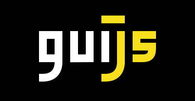

  

# guijs

guijs (stands for *Graphical User Interface for JS projects*) is an app that helps you manage JS projects with a Graphical User Interface.

## Links

- [Website](https://guijs.dev/)
- [Twitter account](https://twitter.com/guijs_official)
- [Contributing guidelines](./CONTRIBUTING.md)
